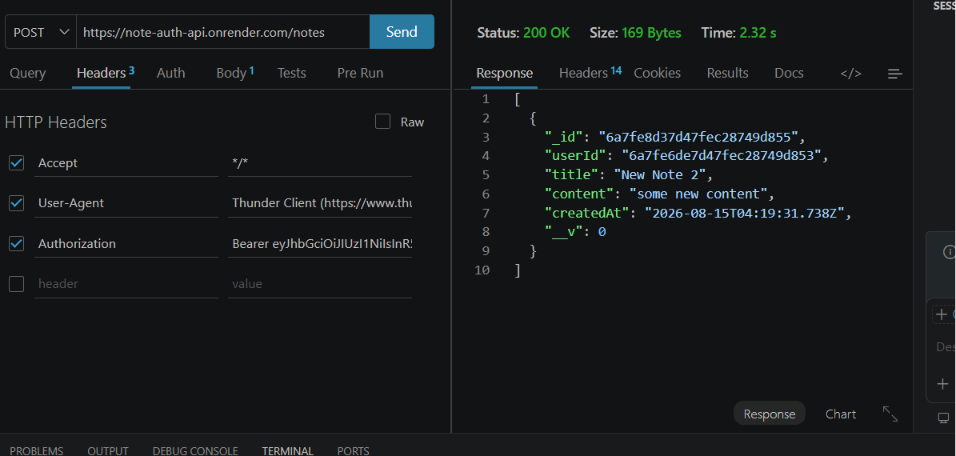

# Note Auth API

You can register and log in to the API. After logging in, you can access the `/notes` endpoint. It's a multi-user API where users can register, log in, and create, update, and delete their own notes.

[Live Demo](https://note-auth-api.onrender.com/)



## Features

- Create and store notes for the logged-in user.
- Test the API using Thunder Client with the `POST /register` and `POST /login` endpoints. Then, access the `/notes` endpoint by including the token in the request header.
- View notes at the `/notes` endpoint.
- Update a note with `PUT /notes/:id`.
- Delete a note with `DELETE /notes/:id`.

## Tech Stack

Built with Express, JavaScript, Node.js, and Mongoose.

## What I Learned

I learned how multi-user authorization works and how to prevent unauthorized users from accessing other users' data.

## How to Run It Locally

```bash
git clone https://github.com/Anshuman56/note-auth-api
cd note-auth-api
npm install
node server.js
```
